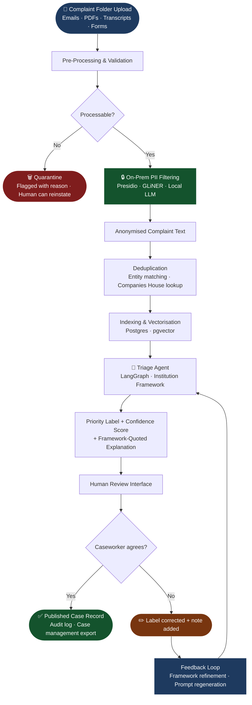
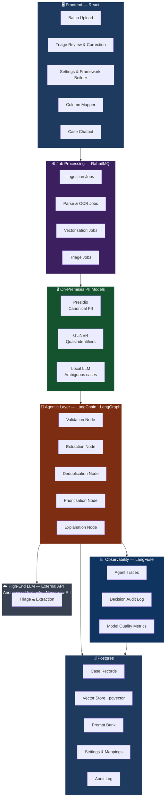

# Triaj
### AI-Powered Complaints Triage for the Public Sector

---

## The Problem

Public institutions in the UK process tens of thousands of complaints every year. The Information Commissioner's Office (ICO) alone receives more than 7,000 complaints annually. Across local councils, NHS trusts, housing associations, ombudsman offices, and regulatory bodies, the total volume runs into the hundreds of thousands — each one representing a citizen who is frustrated, vulnerable, or failed by a system they depend on.

Behind each complaint sits a caseworker. They read emails, dig through attachments, cross-reference prior correspondence, and make a judgement call: how urgent is this? Who does it affect? Does it meet the threshold for escalation? On a good morning, with a fresh mind and a manageable inbox, they do this well. By the afternoon of a heavy caseload day, the quality of those decisions degrades — not through negligence, but through the simple, well-documented reality of decision fatigue.

Research consistently shows that human decision-making accuracy falls as cognitive load increases. In complaints triage, this has direct consequences: genuinely urgent cases can be deprioritised, similar complaints are not linked, and the rationale behind prioritisation decisions is rarely documented in a way that survives scrutiny. For public sector bodies operating under the Equality Act, the Public Sector Equality Duty, and increasingly stringent AI governance frameworks, this inconsistency carries real legal and reputational risk.

The cost is not only human. A single FTE caseworker spending two hours per day on initial triage and sorting across a caseload of 400 complaints per month represents approximately 50 days of staff time annually — time that could be redirected toward resolution, engagement, and service improvement. Across a medium-sized local authority handling complaints across multiple departments, this scales rapidly into hundreds of thousands of pounds of unproductive staff cost.

We propose a better way.

---

## What We Propose

**Triaj** is an open-source, AI-powered complaints triage platform built specifically for UK public sector institutions. It ingests complaints in any format — emails, PDFs, scanned documents, structured forms, phone call transcripts — and intelligently prioritises them against the institution's own defined framework, with full explainability at every step.

Triaj does not replace caseworkers. It gives them back the first hour of their day. It ensures that every complaint is assessed consistently against the same criteria, regardless of when it was received, how it was submitted, or how busy the team is. And it generates an auditable, explainable record of every prioritisation decision made — one that directly quotes the framework it was assessed against, satisfying the most demanding AI governance requirements.

---

## How It Works

The diagram below shows the end-to-end journey of a complaint through Triaj — from raw upload to a labelled, explainable, human-reviewed case record.

---

## Core Capabilities

### Flexible Complaint Ingestion

Complaints arrive in the real world through many channels and in many formats. Triaj is designed to handle this reality. Case folders — each containing the full correspondence history, attachments, transcripts, and structured intake forms for a single complaint — can be uploaded individually or as a batch of up to 50 at a time, either as organised folders or as a single compressed archive.

Each folder is treated as a complete case dossier. Triaj understands that a complaint is not a single document — it is a body of evidence, and it processes it as such.

### Pre-Processing and Validation

Before any AI analysis begins, Triaj validates each incoming case. Not everything submitted through a complaints channel is a processable complaint. Some submissions are out of scope. Some are missing critical information. Some are simply noise.

Triaj's pre-processing layer assesses each case and routes it appropriately. Cases that cannot be processed are moved to a quarantine state with a clear reason — not silently discarded. Case managers can review quarantined submissions at any time and reinstate them if they judge them legitimate, with that reinstatement decision recorded for future pipeline improvement.

### PII Filtering — On Premises, Before Persistence

Data protection is not an afterthought in Triaj — it is the first thing that happens. Before any complaint data touches a persistence layer or a cloud-based model, it passes through an on-premises PII filtering pipeline.

This pipeline uses a layered approach: a purpose-built anonymisation library handles canonical identifiers such as names, email addresses, phone numbers, National Insurance numbers, and postcodes. A generalist entity recognition model then catches quasi-identifiers — the contextual details that, while not obviously personal data, could identify an individual in combination with other information. Only anonymised content proceeds further. The original, unanonymised complaint data is stored in encrypted form on the institution's own infrastructure, and the anonymisation layer means that vectors and indices contain no recoverable personal information.

When a complaint is deleted under a subject access or right-to-erasure request, its vector representation is re-anonymised rather than deleted outright, preserving the integrity of the search and analytics layer while honouring the individual's legal rights.

### Intelligent Indexing and Vectorisation

Once validated and anonymised, each complaint is indexed and vectorised for semantic search and cross-complaint analysis. This enables the triage engine to identify patterns across the caseload — recurring themes, related complainants, systemic issues affecting the same service area — that would be invisible to a caseworker reviewing cases individually.

The vectorisation layer is built on Postgres with pgvector, keeping the entire data estate within the institution's own infrastructure with no dependency on external vector databases or third-party services.

### Institution-Defined Prioritisation Frameworks

Every public institution prioritises complaints differently. A housing association weighs disrepair differently to a council. An NHS trust has different escalation thresholds to an ombudsman. Triaj does not impose a generic framework — it learns yours.

During onboarding, institutions are guided through a structured questionnaire that captures their prioritisation logic: what factors matter, how they are weighted, what constitutes an urgent case, and what falls below the threshold for immediate action. Alternatively, if the institution already has a documented prioritisation framework — a policy PDF, a governance document, an internal handbook — they can upload it directly and Triaj will extract and codify the logic from that document.

From this input, Triaj generates a structured prioritisation prompt that is stored in an internal prompt bank. This prompt governs how the AI agent evaluates and labels every complaint. It can be reviewed, adjusted, and reissued at any time — giving institutions full control over the logic their complaints process runs on.

### Case Column Mapping

Not all case management systems are alike. Triaj includes a dedicated screen for mapping the fields that matter to the institution's specific case management workflow — linking the AI's output to the columns, categories, and reference structures already in use. This mapping is configured once at onboarding and can be updated as needs evolve.

### AI Triage and Prioritisation

With the framework established and the data prepared, Triaj's triage agent processes each complaint. For every case, it extracts the relevant fields, applies the institution's prioritisation logic, assigns a label, and generates a confidence score reflecting the clarity of the decision.

Critically, every prioritisation decision is accompanied by a structured explanation that directly quotes the applicable section of the institution's own framework. This is not a black box. If a complaint is marked urgent because it involves a vulnerable adult and the framework specifies that vulnerability is a first-order escalation factor, the agent's explanation will say precisely that — in the framework's own words. This explainability is a core design principle, not a feature added after the fact, and it directly satisfies the requirements of the UK Government's AI procurement guidance and the emerging standards of the ICO's AI auditing framework.

### Human Review and Correction

AI triage is a recommendation, not a verdict. Triaj includes a dedicated review interface where case managers can examine the AI's prioritisation decisions, disagree with them, update labels, and add notes explaining where and why the AI's assessment was wrong.

This is not just a safety valve — it is a learning mechanism. Every correction made by a human reviewer is captured and feeds back into the prioritisation framework. Over time, the patterns in human corrections are used to intelligently surface gaps or ambiguities in the framework itself, and to propose refinements to the underlying prioritisation logic. The system gets better because people use it honestly.

### Deduplication

Complainants in the public sector frequently contact institutions through multiple channels — email, phone, web form, in person — about the same underlying issue. Without deduplication, these appear as separate complaints, inflating caseload numbers and causing the same issue to be assessed multiple times by different caseworkers.

Triaj applies entity-level deduplication across complaints, matching on subjects, organisations, reference numbers, and thematic similarity. For organisation matching, it can be configured to cross-reference against authoritative sources such as Companies House, ensuring that name variations and subsidiaries are correctly resolved. Ambiguous cases are flagged for human review rather than automatically merged.

### Optional Case Chatbot

For institutions that want conversational access to their complaints data, Triaj includes an optional case chatbot. Caseworkers can ask natural language questions across the full caseload — finding related cases, surfacing trends, retrieving specific details — without needing to understand the underlying query structure. The chatbot operates entirely over anonymised, vectorised data and respects the institution's access control configuration.

---

## Architecture and Technology

Triaj is built on a modern, fully open-source stack selected for reliability, long-term maintainability, and deployability within the infrastructure constraints common to UK public sector environments — including on-premises, private cloud, and government-approved secure cloud tiers.

### Technology Stack

| Layer | Technology | Role |
|---|---|---|
| **Frontend** | React | Upload UI, triage review, settings, case chatbot |
| **Agentic Workflow** | LangChain + LangGraph | Stateful multi-step pipeline — validation, extraction, deduplication, prioritisation, explanation |
| **Job Queue** | RabbitMQ | Async batch processing — each complaint is an independent job with retry logic |
| **Observability** | LangFuse | Full agent tracing, decision audit log, model quality metrics |
| **PII Filter — Layer 1** | Microsoft Presidio | Canonical PII: names, NI numbers, emails, postcodes, phone numbers |
| **PII Filter — Layer 2** | GLiNER | Quasi-identifiers and contextual personal details — no fine-tuning required |
| **PII Filter — Layer 3** | Local LLM (Phi-3 / Llama 3.2) | Ambiguous edge cases — on-premises only, never external |
| **Triage & Extraction** | High-end LLM (API) | Operates on anonymised text only — never sees raw complaint data |
| **Vector Store** | Postgres + pgvector | Semantic search and cross-complaint pattern detection |
| **Case & Settings DB** | Postgres | Case records, prompt bank, column mappings, audit trail |
| **Document Parsing** | Tesseract / Surya | OCR for scanned PDFs and image-based attachments |
| **Containerisation** | Docker | On-premises and cloud deployment — no vendor lock-in |

The decision to consolidate on **Postgres** as the single data store — rather than introducing a dedicated vector database alongside a relational one — is deliberate. It reduces operational surface area, simplifies backup and recovery, and keeps the entire case data estate in one auditable location. pgvector provides production-grade vector search at the complaint volumes Triaj is designed for, without the overhead of an additional managed service.

**RabbitMQ** job isolation at the individual complaint level is equally intentional. Batch uploads of 50 complaints will inevitably contain a small number of complex cases — folders with many large scanned attachments, for example. Isolating each complaint as its own job means one slow case does not delay the rest of the batch, and failures are retried individually rather than requiring the whole batch to be resubmitted.

---

## AI Governance

Triaj is designed from the ground up to meet the standards that public sector AI deployments are held to. Every prioritisation decision is explainable, every framework change is versioned, every human correction is logged, and the PII filtering architecture ensures that sensitive personal data is never exposed to external models or services.

The system produces an auditable record of its behaviour that can be shared with oversight bodies, subject to freedom of information requests, or reviewed by the institution's own data protection officer. This is not compliance as a checkbox — it is the foundation of trustworthy automated decision support in a public sector context.

| Governance Requirement | How Triaj Addresses It |
|---|---|
| Explainability | Every label is accompanied by a framework-quoted rationale |
| Data minimisation | PII is stripped on-premises before any external model call |
| Right to erasure | Vectors are re-anonymised on complaint deletion, not simply removed |
| Audit trail | All decisions, corrections, and framework changes are logged with timestamps |
| Human oversight | No decision is published without passing through the human review interface |
| Framework versioning | Every change to prioritisation logic is versioned and attributable |

---

## Status

Triaj is an open-source project in active development. Contributions, feedback, and early deployment partnerships are welcome.

---

## Licence

MIT

---

*Triaj — from the French "triage": to sort, to separate, to give each thing its proper place.*
